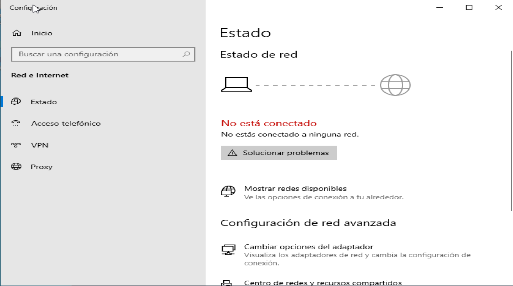
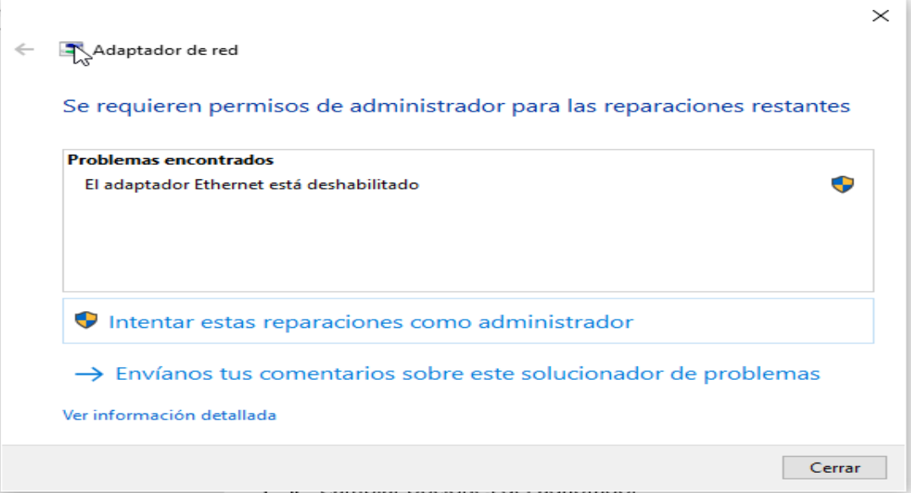
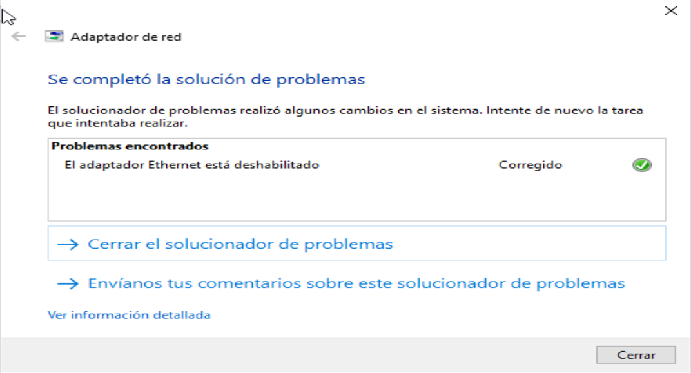

# Lab 01 — Pérdida de conectividad de red

**Tipo de práctica:** incidencia simulada en una máquina virtual con Windows 10 (VirtualBox).

## 📋 Ticket

**Usuario:** Laura Benítez  
**Departamento:** Administración  
**Problema reportado:** El usuario informa que perdió el acceso a Internet. Otros usuarios de la empresa mantienen conexión normalmente.

El usuario y el departamento forman parte del escenario simulado.

### Estado inicial

Windows mostraba que el equipo no estaba conectado a ninguna red.

---

## 🔍 Diagnóstico

Al comprobar el estado de conectividad del equipo se detectó que el adaptador de red Ethernet se encontraba deshabilitado.

Se utilizó el solucionador de problemas de Windows como herramienta de diagnóstico, que permitió detectar el problema relacionado con el adaptador de red.

El solucionador indicó que el adaptador Ethernet estaba deshabilitado y solicitó permisos de administrador para continuar con la reparación.

---

## ⚠️ Causa

El adaptador de red Ethernet del equipo estaba deshabilitado, impidiendo que Windows utilizara la interfaz para comunicarse con la red.

---

## 🛠️ Solución

Se habilitó nuevamente el adaptador Ethernet mediante el solucionador de problemas de Windows.

---

## ✅ Verificación

Después de habilitar el adaptador:

- El equipo recuperó la conexión de red.
- Abrí el navegador y comprobé que podía acceder a Internet. No se tomó una captura de esta prueba.

---

## 🧠 Aprendizaje

Este laboratorio me permitió comprender que un reporte de "no tengo Internet" representa un síntoma y no necesariamente la causa del problema.

Antes de asumir que existe un problema con Internet, es necesario determinar el alcance de la incidencia y comprobar el estado de la conectividad local del equipo.

También aprendí la importancia de diferenciar entre:

- Problema reportado
- Diagnóstico
- Causa
- Solución
- Verificación

## 🔧 Herramientas utilizadas

- Windows 10
- VirtualBox
- Solucionador de problemas de Windows
- Configuración de red de Windows
- Navegador web para la verificación
