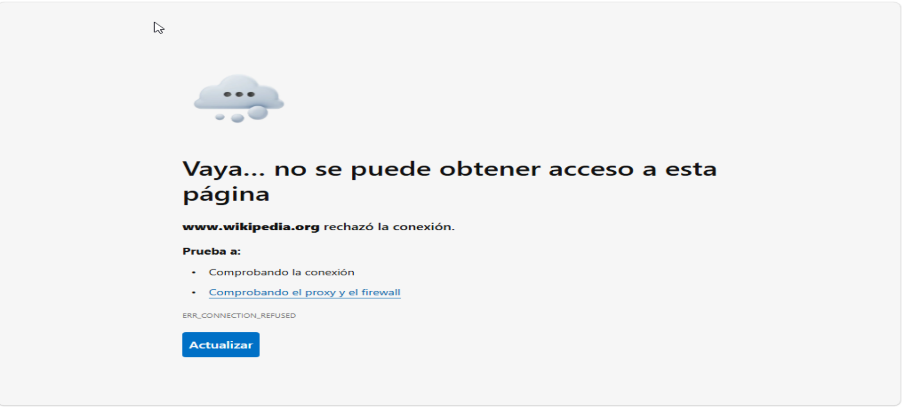
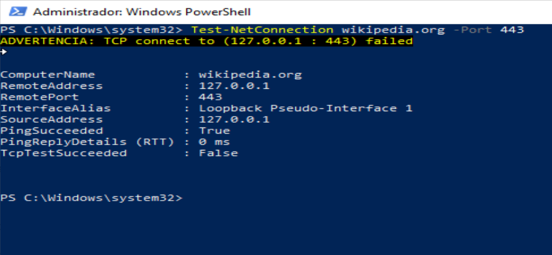
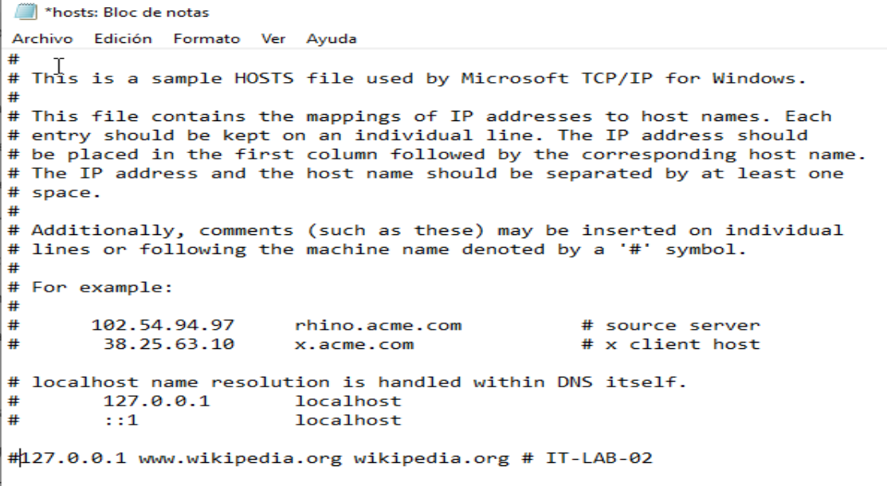

# Ticket 02 — Una página web no abre

**Entorno:** incidencia simulada en una VM con Windows 10 y VirtualBox. El usuario y el departamento son ficticios.

## Ticket

**Usuario:** Martín Vera  
**Departamento:** Compras  
**Problema reportado:** No puede abrir Wikipedia desde su equipo, mientras que otras páginas funcionan y un compañero sí puede acceder.

## Problema

Al abrir Wikipedia en el navegador de la VM apareció el mensaje «www.wikipedia.org rechazó la conexión» (`ERR_CONNECTION_REFUSED`).

## Diagnóstico

Se comprobó que el problema afectaba a ese sitio en el equipo de la práctica. Con `Test-NetConnection wikipedia.org -Port 443`, Windows intentó conectarse a `127.0.0.1:443`. La prueba TCP falló (`TcpTestSucceeded: False`). La dirección `127.0.0.1` corresponde al propio equipo; `PingSucceeded: True` solo confirmó que respondía la interfaz local, no que Wikipedia fuera accesible.

Después se revisó el archivo `hosts` de Windows y se encontró una entrada que asociaba `www.wikipedia.org` y `wikipedia.org` con `127.0.0.1`.

## Causa

La entrada del archivo `hosts` dirigía esos nombres al propio equipo. Por eso el navegador intentaba conectarse localmente en vez de llegar al sitio web.

## Solución

Se desactivó la entrada incorrecta del archivo `hosts` anteponiendo `#` a la línea y se guardó el archivo. `#` convierte la línea en un comentario para que Windows deje de usar esa asociación.

**Nota sobre la captura:** el asterisco junto al nombre `hosts` indica que el cambio aún no estaba guardado cuando se tomó la imagen. La captura ilustra la corrección en el editor; la prueba de funcionamiento posterior se describe a continuación.

## Verificación

Tras aplicar la corrección, volví a abrir Wikipedia en el navegador y confirmé que la página cargaba correctamente. Esta comprobación fue reportada durante la práctica; no se adjuntó una captura de la página ya abierta.

## Aprendizajes

- Delimitar si la incidencia afecta a un sitio o a toda la conexión.
- Distinguir una respuesta de `ping` local de una conexión TCP exitosa al servicio web.
- Revisar la resolución de nombres local cuando un dominio apunta a una dirección inesperada.
- Documentar por separado lo observado, la causa, la reparación y la verificación.

**Herramientas utilizadas:** navegador web, PowerShell (`Test-NetConnection`), Bloc de notas y archivo `hosts` de Windows.
