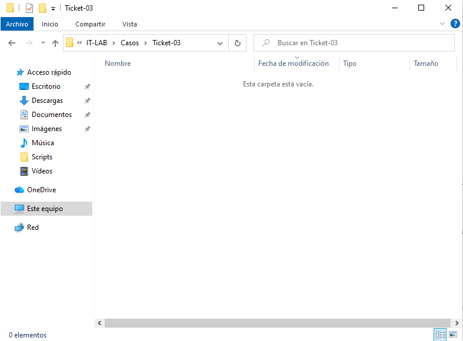
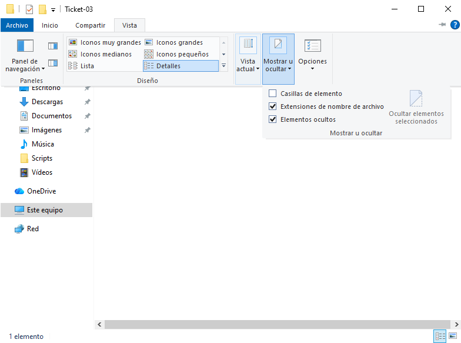
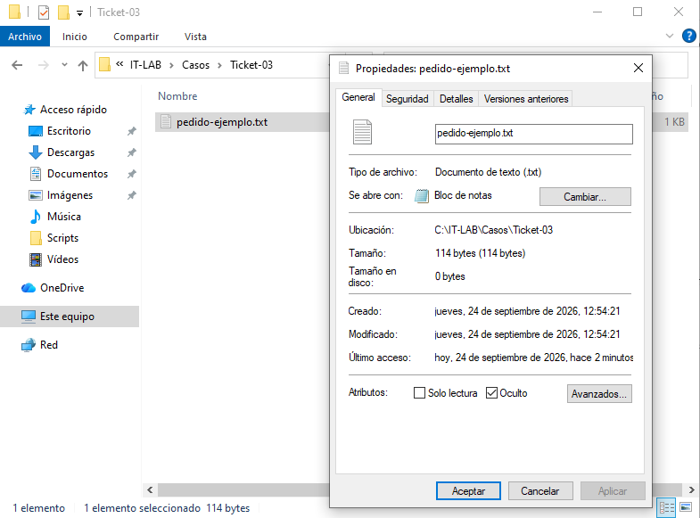
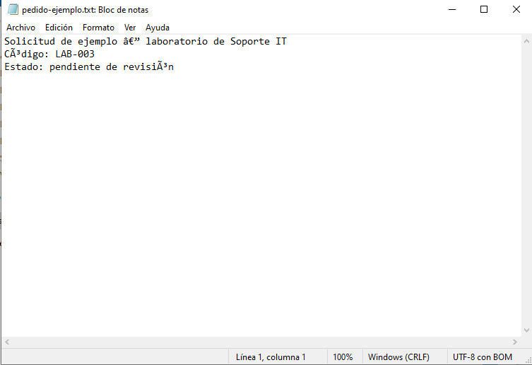

# Lab 03 — Archivo que no aparece

**Tipo de práctica:** incidencia simulada en una máquina virtual con Windows 10 (VirtualBox).

## Ticket

**Usuario ficticio:** Martín Vera, departamento de Compras.
**Problema reportado:** `pedido-ejemplo.txt` no aparecía en `C:\IT-LAB\Casos\Ticket-03`, aunque el usuario necesitaba consultarlo.

## Problema

El Explorador mostraba la carpeta vacía.

## Diagnóstico

Al intentar guardar otro archivo con el mismo nombre en la carpeta, Windows ofreció reemplazar el existente. Esto indicó que el archivo seguía allí. Revisé la pestaña **Vista**: la opción **Elementos ocultos** estaba desmarcada. Al activarla, el archivo apareció. En sus propiedades comprobé que tenía marcado el atributo **Oculto**.

## Causa

El archivo tenía el atributo **Oculto** y el Explorador estaba configurado para no mostrar elementos ocultos. El archivo no había sido eliminado.

## Solución

Desmarqué el atributo **Oculto** en las propiedades del archivo.

## Verificación

Volví a desactivar **Elementos ocultos** y confirmé que el archivo permanecía visible. También pude abrirlo y leerlo en el Bloc de notas.

La última captura muestra algunos caracteres acentuados incorrectamente por la codificación del texto de ejemplo; esto es independiente de la incidencia del archivo oculto. La comprobación de visibilidad con **Elementos ocultos** desactivado fue realizada durante la práctica, aunque no se tomó una captura de ese paso final.

## Aprendizaje

- Una carpeta que parece vacía no demuestra que sus archivos hayan sido borrados.
- Una advertencia de reemplazo puede indicar que ya existe un archivo con ese nombre.
- Mostrar archivos ocultos sirve para diagnosticar; quitar el atributo **Oculto** permite que el archivo siga visible con la configuración habitual del Explorador.

## Herramientas utilizadas

- Explorador de archivos de Windows 10
- Propiedades del archivo
- Bloc de notas para comprobar la apertura
