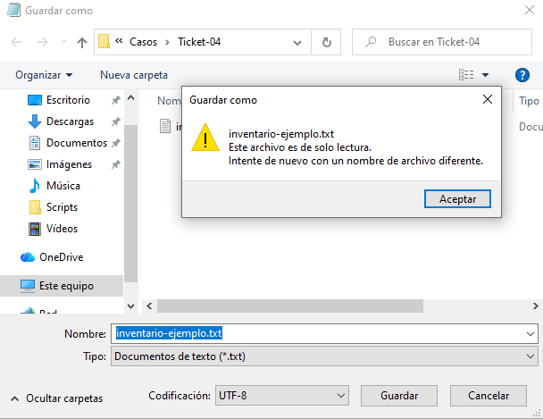
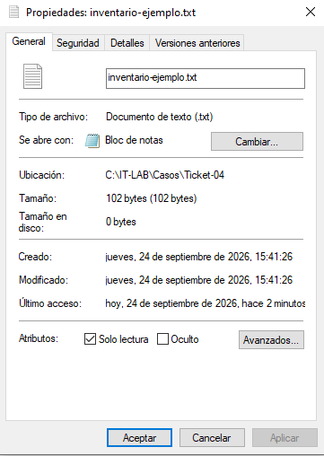
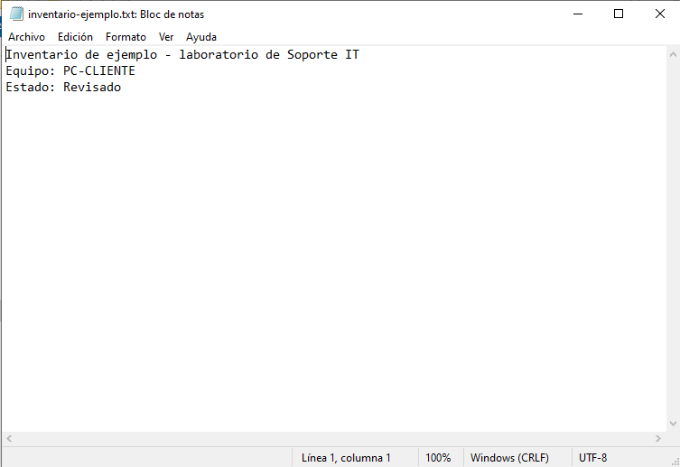

# Lab 04 — No se guardan los cambios

**Tipo de práctica:** incidencia simulada en una máquina virtual con Windows 10 (VirtualBox).

## Ticket

**Usuario ficticio:** Martín Vera, departamento de Compras.

**Problema reportado:** El usuario podía abrir `C:\IT-LAB\Casos\Ticket-04\inventario-ejemplo.txt`, pero no podía guardar los cambios en el mismo archivo.

## Problema

Al intentar modificar el estado y guardar el archivo, el Bloc de notas avisó que era de solo lectura y pidió usar otro nombre.

## Diagnóstico

Reproduje el problema al intentar guardar una modificación. Después revisé las propiedades del archivo y comprobé que la casilla **Solo lectura** estaba marcada.

## Causa

El archivo tenía activado el atributo **Solo lectura**, que impedía guardar los cambios directamente en ese archivo.

## Solución

Desmarqué **Solo lectura** en las propiedades del archivo y apliqué el cambio.

## Verificación

Cambié el estado a **Revisado**, guardé el archivo, lo cerré y volví a abrirlo. El cambio permanecía.

La captura muestra el contenido tras la reparación; la comprobación de cerrar y volver a abrir fue realizada durante la práctica.

## Aprendizaje

- Reproducir el aviso antes de modificar la configuración ayuda a identificar la causa.
- El atributo **Solo lectura** afecta la posibilidad de guardar cambios directamente en el archivo.
- Volver a abrir un archivo después de guardarlo confirma que el cambio persistió.

## Herramientas utilizadas

- Bloc de notas de Windows 10
- Explorador de archivos y propiedades del archivo
