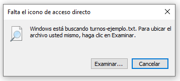
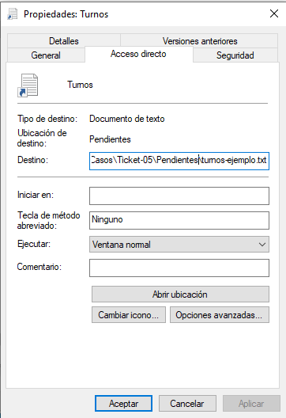
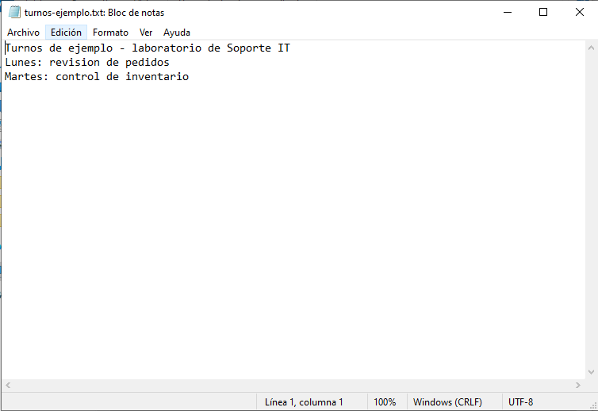

# Lab 05 — Acceso directo con destino incorrecto

**Tipo de práctica:** incidencia simulada en una máquina virtual con Windows 10 (VirtualBox).

## Ticket

**Usuario ficticio:** Martín Vera, departamento de Compras.

**Problema reportado:** El usuario no podía abrir el documento de turnos mediante el acceso directo `Turnos` ubicado en `C:\IT-LAB\Casos\Ticket-05`.

## Problema

Al hacer doble clic en `Turnos`, Windows mostró el aviso «Falta el icono de acceso directo» e indicó que buscaba `turnos-ejemplo.txt`. El documento no se abrió.

## Diagnóstico

Revisé las propiedades del acceso directo. El campo **Destino** apuntaba a la carpeta `Pendientes`, aunque el documento de práctica estaba en `Documentos`.

## Causa

El acceso directo señalaba una ruta incorrecta. El archivo original seguía en la carpeta `Documentos`; no era necesario recrearlo ni moverlo.

## Solución

Cambié el destino del acceso directo para que apuntara a `C:\IT-LAB\Casos\Ticket-05\Documentos\turnos-ejemplo.txt`.

## Verificación

Cerré el documento y volví a abrirlo haciendo doble clic en `Turnos`. Se abrió sin aviso y pude consultar el contenido.

La última captura muestra el documento abierto. La comprobación de que se abrió específicamente desde el acceso directo corregido fue realizada durante la práctica y confirmada por el técnico.

## Aprendizaje

- Un acceso directo puede fallar aunque el documento original todavía exista.
- El texto de un aviso debe leerse completo: aunque el título mencione el icono, Windows estaba buscando el documento.
- Comprobar el campo **Destino** y probar nuevamente el mismo acceso directo permite verificar la reparación.

## Herramientas utilizadas

- Explorador de archivos de Windows 10
- Propiedades de un acceso directo
- Bloc de notas para confirmar la apertura del documento
